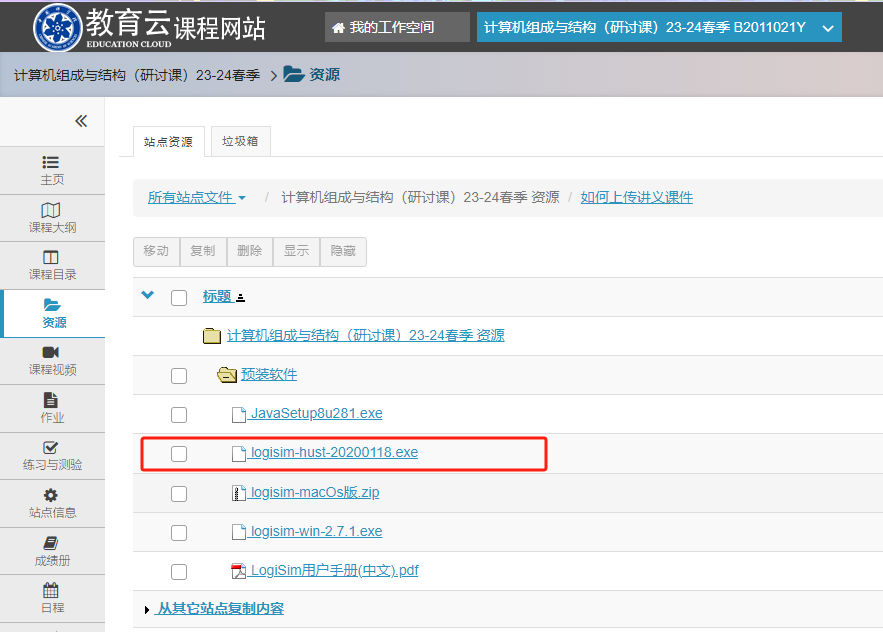
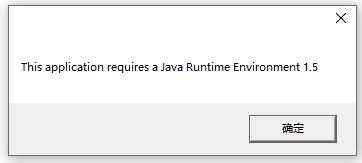
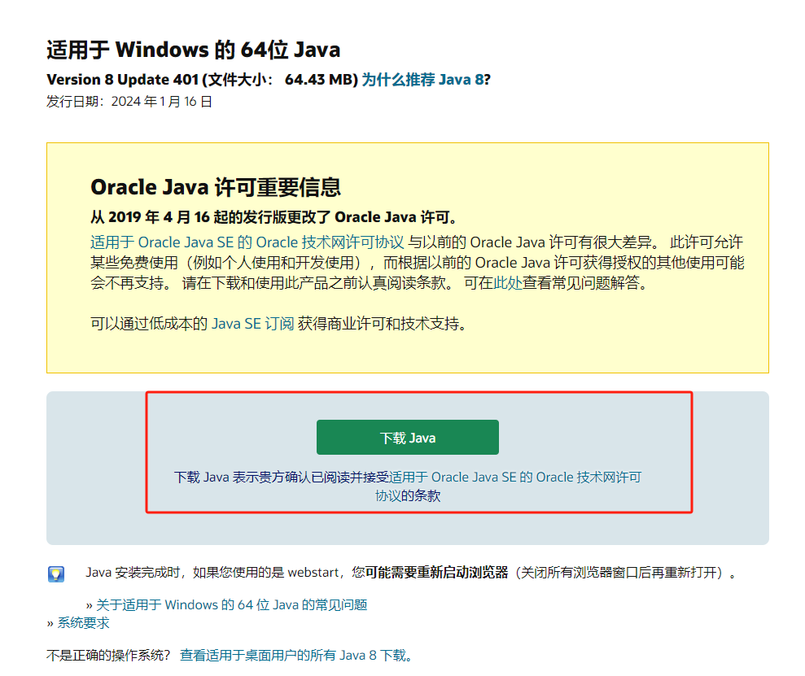
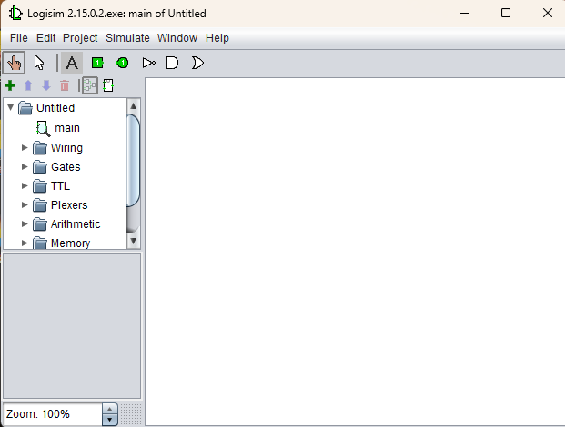
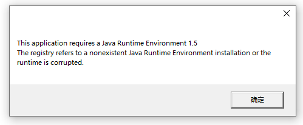
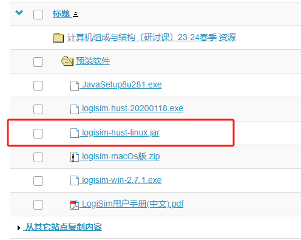
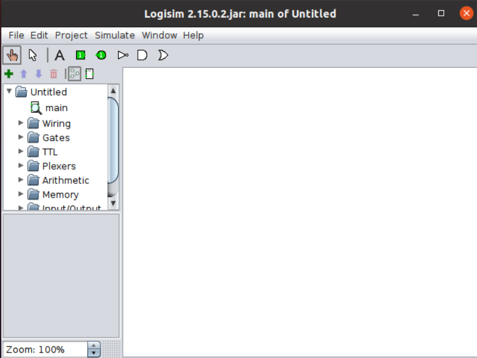
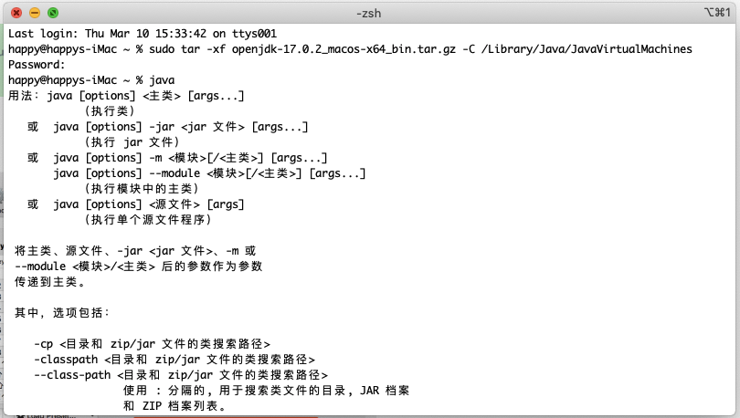
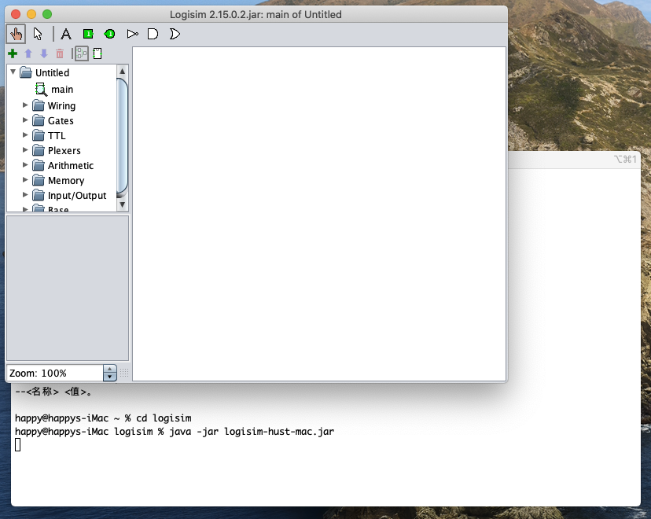

# Logisim 的 JAVA 环境配置


## 引言

Logisim 需要目标计算机存在 Java Runtime Environment 1.5 及以上的运行环境。JRE 一般由发行软件附带，但 Logisim 不提供完整的运行时环境，因此我们需要额外配置 JRE 。

## Windows 用户

在课程网站上下载 **logisim-hust-20200118.exe**



若可以直接打开 Logisim ，那么恭喜可以跳过后文，直接开始做实验。

若打开提示如下图，则需要配置 JRE。



点击确定则会跳转到下面网址下载 JRE 环境。

[https://www.java.com/zh-CN/download/](https://www.java.com/zh-CN/download/ "https://www.java.com/zh-CN/download/")

进入网页后，选择下载 java。待下载完成后，按提示安装即可。



待安装后，应该就能正常打开 Logisim，显示如下的界面。



***

**如果上面的方法无法成功，可以尝试下面的方法。**

使用 OpenJDK 提供的 JRE，在 [https://jdk.java.net/17/](https://jdk.java.net/17/ "https://jdk.java.net/17/") 可以下载各个平台的 JDK。或者使用 [Microsoft JDK ](https://docs.microsoft.com/zh-cn/java/openjdk/download "Microsoft JDK ") 提供的更多平台支持的发行版。

您也可以使用本机已存在的 OpenJDK ，而不是最新的 17.0.2 版本。

以 OpenJDK 为例，下载 `openjdk-17.0.2_windows-x64_bin.zip`，解压在任意目录，例如 `D:\.jdks\jdk-17.0.2`。

此时，创建 `.reg` 为后缀 Windows 注册表项，写入

```bash
Windows Registry Editor Version 5.00
 
[HKEY_LOCAL_MACHINE\SOFTWARE\JavaSoft]
 
[HKEY_LOCAL_MACHINE\SOFTWARE\JavaSoft\Java Runtime Environment]
"CurrentVersion"="17.0.2"

[HKEY_LOCAL_MACHINE\SOFTWARE\JavaSoft\Java Runtime Environment\17.0.2]
"JavaHome"="D:\\.jdks\\jdk-17.0.2"
```

根据实际情况修改，保存后双击写入注册表。

至此完成 OpenJDK 的配置，双击打开 Logisim 。

**注**：若如下图，则是配置目录错误，请打开注册表 `HKEY_LOCAL_MACHINE\SOFTWARE\JavaSoft\Java Runtime Environment`，进行修改。



## linux 用户

打开终端，键入 `java`，若执行失败需要安装 JDK。比如输入如下命令：

```纯文本
sudo apt update
sudo apt install -y openjdk-17-jre-headless
```

下载课程网站的 `logisim-hust-linux.jar`



也可以直接输入命令从网上下载

```bash
wget https://gitee.com/totalcontrol/hustzc/blob/master/%E9%A2%84%E8%A3%8s5%E8%BD%AF%E4%BB%B6/logisim-hust-linux.jar

```

有了 `logisim-hust-linux.jar` 后，输入以下命令即可打开 Logisim

```bash
java -jar [logisim-hust-linux.jar的路径]
```

成功的话，会出现如下结果：



## macOS 用户

打开终端，键入 `java`，若执行失败需要安装 JDK。

以 OpenJDK 为例，下载 `openjdk-17.0.2_macos-x64_bin.tar.gz`

在下载目录中，打开终端，键入

```bash
sudo tar -xf openjdk-17.0.2_macos-x64_bin.tar.gz -C /Library/Java/JavaVirtualMachines
```

此时要求输入用户密码，以便向目标目录解压文件。



输入后，macOS 便具有了 JRE ，简单地，通过键入 `java -jar logisim-hust-mac.jar` 打开 Logisim 。


