# Logisim 实用技巧

## 基本界面介绍

主界面大概是下图这样，和很多软件的风格都差不多。

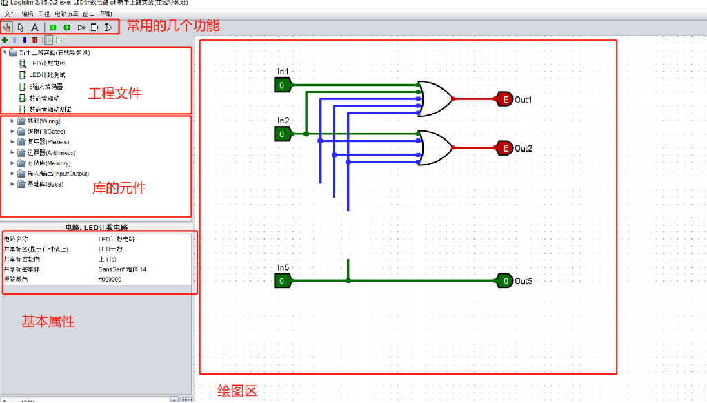

先来看看最上面这一排图标，从左到右分别是：仿真、连线（移动）、添加文字。后面五个是比较常用的电路组件，分别是输入引脚、输出引脚、非门、与门、或门。

输入引脚和输出引脚接反是无法正常仿真的，输入引脚是方的，输出引脚是圆的。

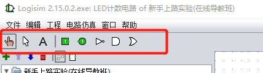

这一排对这个新手上路实验的工程进行编辑，从左到右分别是添加电路、上移电路、下移电路、删除电路。右边两个是在电路原理图界面和封装切换。

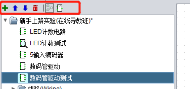

下面就是库了，要用库里的元件的话，只要左键选中元件，然后在鼠标移到右边绘图区，就会自动出现电路元件了。比如我们选中译码器，可以看到右边出现灰色的元件，此时在左键点击一下，就可以放置元件了。

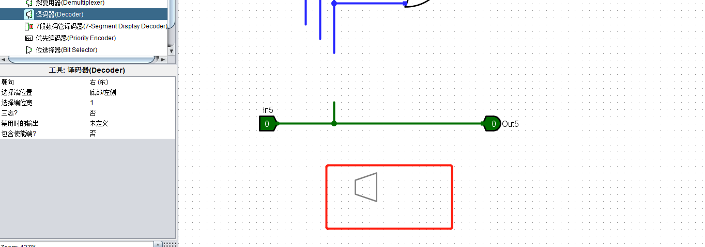

接下来是属性框，可以更改元件的属性，比如我们选中这个输出引脚。可以看到都有这些属性，并且可以在属性框中修改。

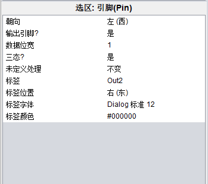

属性下方的这个按钮，可以让电路图出现点阵。

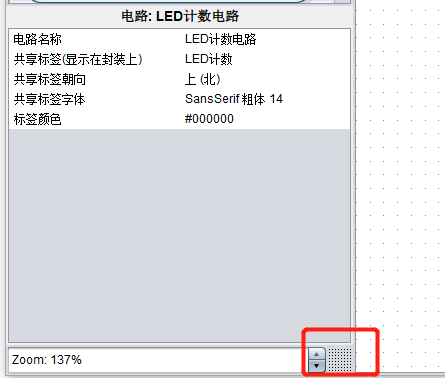

接下来看下绘图区，线大概有这几种颜色，分别代表的含义在图中也列出来了。

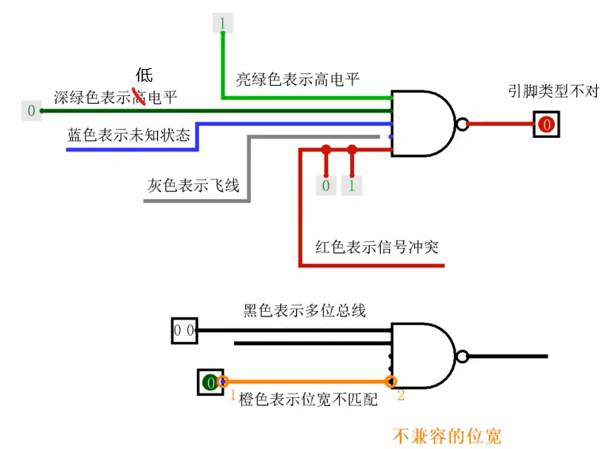

接下来看看封装的界面。可以右键选中电路然后点编辑电路封装，也可点第二个菜单栏垃圾桶旁边 2 个的按钮切换到封装界面。可以看到这样的界面。但是默认一般不是这样的，这是手动画的。画的话也很简单，类似普通的画图软件。颜色的话在属性框可以调。中间的绿色符号可以不用动他。

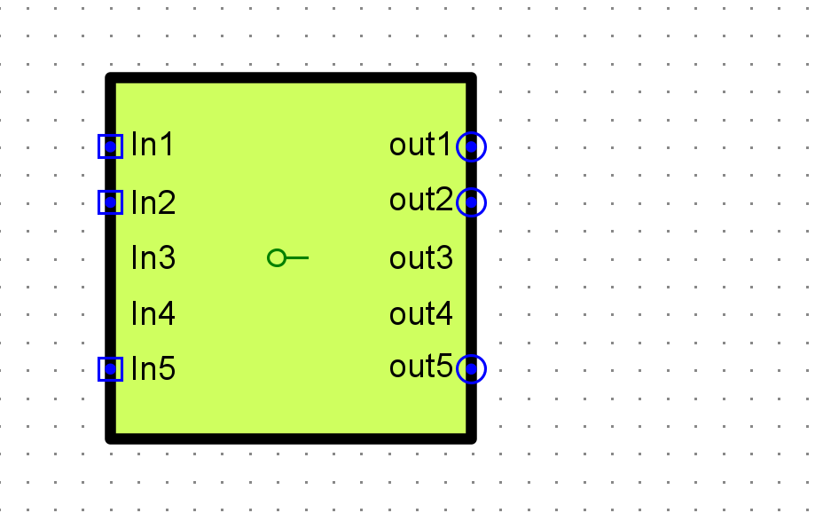

我们画好的电路可以在别的电路调用，类似库的调用方法。一般实验不需要动这个封装。建议做实验前看一眼封装的样子，很多评测出问题都是封装的引脚变化了，导致本地运行可以，在线评测过不去。

## 自动生成电路

自动生成不能生成那种带封装的。所以自动生成一般用来生成比较简单的电路。然后最后再手工把这些简单的电路连起来。

### 真值表生成电路

点击工程，然后再点击分析组合逻辑电路。

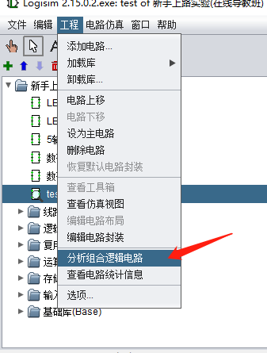

会出现如下界面，可以在输入、输出选项卡添加自己电路的引脚名。比如我们输入为 x，y，输出为 z。

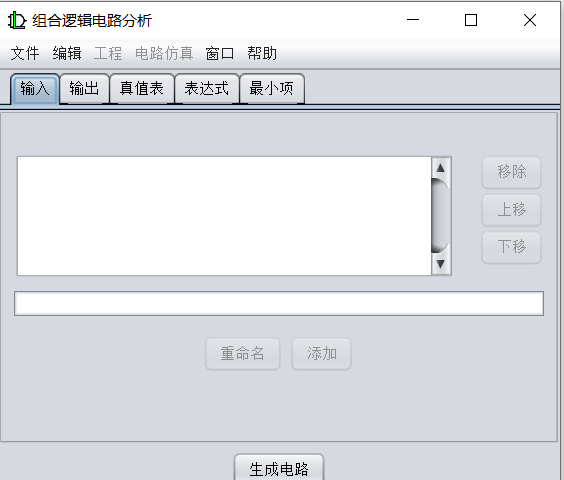

然后我们根据需求修改真值表。比如改成这样。

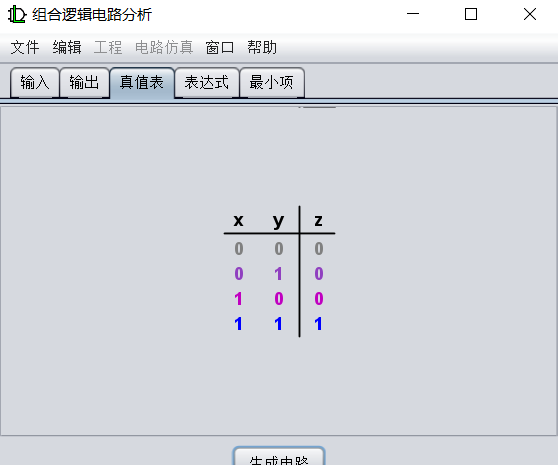

然后点击生成电路，然后再点确定，最后可以看到生成了电路。

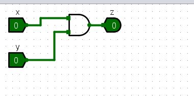

### 表达式生成电路

表达式生成电路的前面几个步骤和真值表一样。区别在于，我们这次不改真值表，改表达式。比如我们改成 x+y，然后点击生成电路。

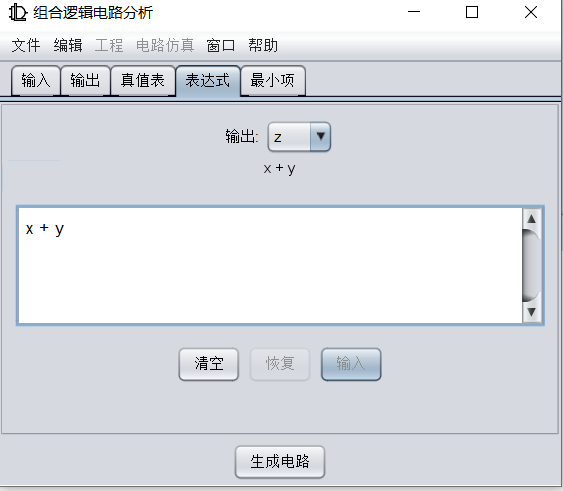

可以看到生成了 s 电路。

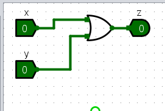

### 自动生成电路的妙用

由于自动生成电路会覆盖电路原有的模板，所以对于很多头歌平台上的实验并不能直接使用这个功能。

但是可以新建一个空白电路，在空白电路上使用自动生成电路，然后在主电路上调用自动生成的电路。也能达到一样的目的。下面给出一个具体示例。

假设我们要设计 8 位无符号比较器，并且手头上有两片 4 位无符号比较器，那么要如何利用手头的 4 位无符号比较器扩展为 8 位无符号比较器？

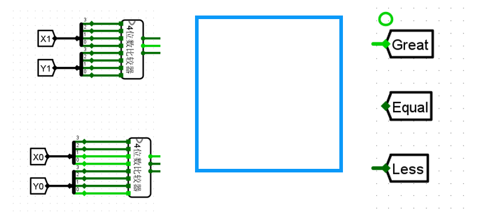

新建一个子电路，利用逻辑表达式自动生成。生成如下的电路。

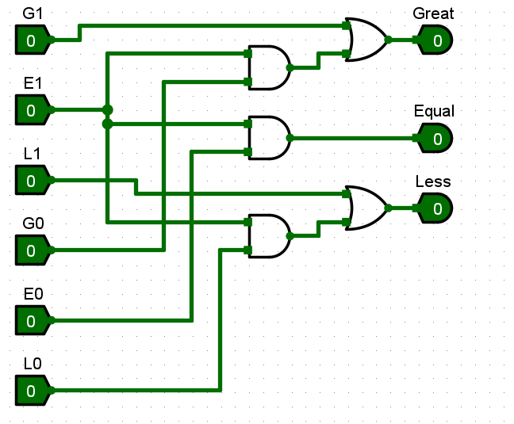

然后在主电路上调用刚刚上面生成的电路。

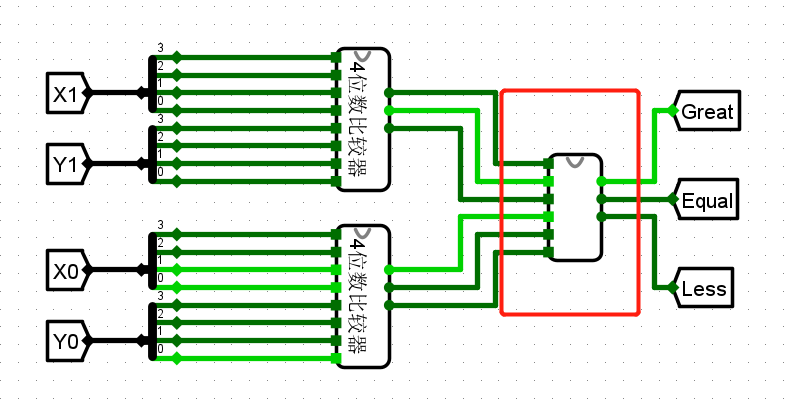

## 常用的快捷键

和其他软件的快捷键差不多

- Ctrl + C : 复制
- Ctrl + V：粘贴
- Ctrl + Z：撤回

其他特有的：

- Ctrl + D：复制
- 选中元件按数字键：修改元件的输入接口
- 选中元件按数字键：修改元件的输入位宽
- 选中元件按方向键：修改元件的朝向

## 连线技巧

- 用隧道标签
- 分线器
- 相同器件比较多的情况下，可以复制一下

比如下面这种连线：

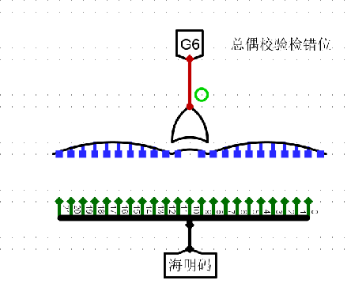

就可以直接拖动分线器对准异或门的接口

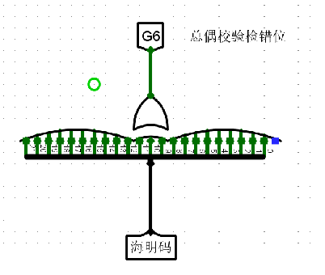

再把他拉开，就可以发现连好了大部分的线，最后再连一根线即可。

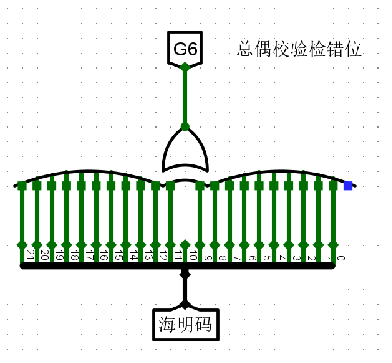

## 调试技巧

### 用探针进行调试

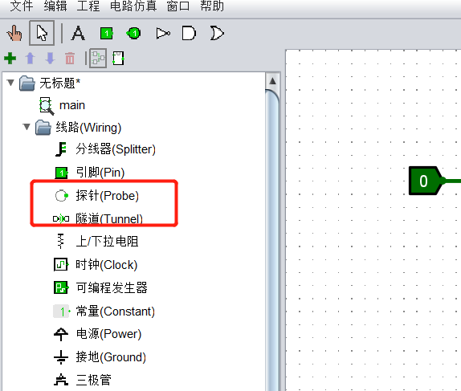

探针可以显示电路线上的值。是很方便的调试工具。

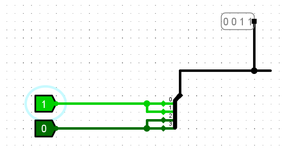

### 单步调试

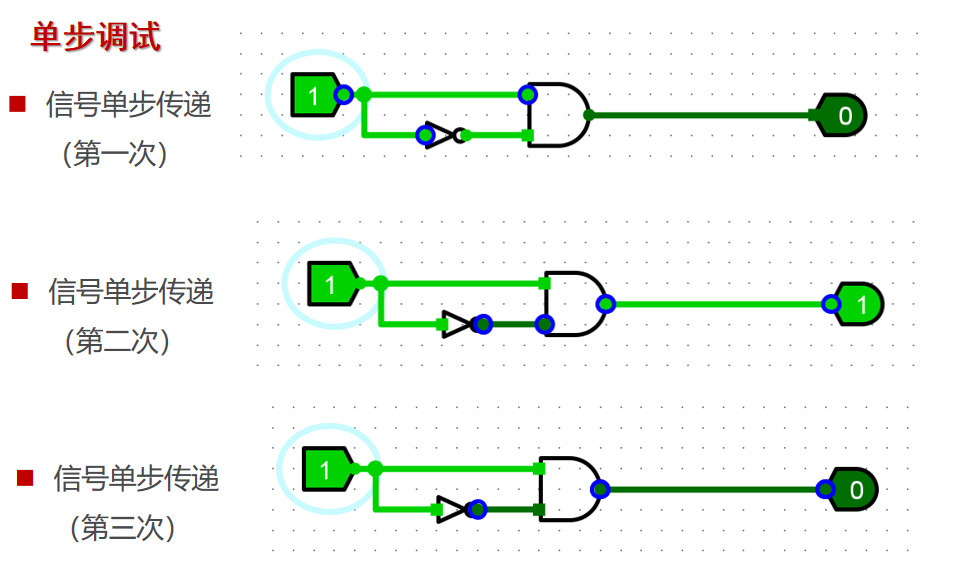
