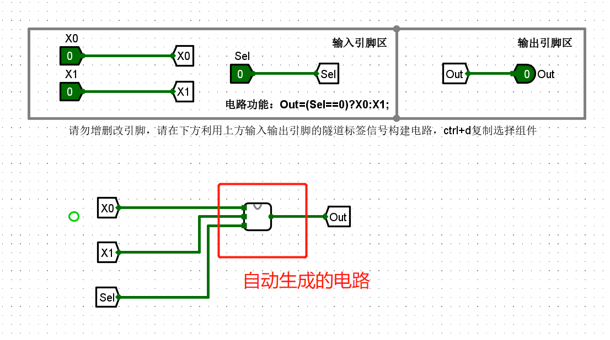

# Logisim 入门实验问题汇总

## 课堂实验

### 问题 1：线是蓝的或者红的。怎么点小手的调试按钮都没有反应？

解决方法：

- 检查电路有没有连错，有没有线连在一起了？
- 重启 Logisim 软件

### 问题 2：在本地测试没问题，提交到头歌平台都是 `xxx`？

原因：有的电路为了评测方便，固定好了引脚。比如下面这样：

如果用自动电路生成，就会覆盖掉设置好的引脚，导致在头歌平台评测失败。

解决：

可以新建空白电路用自动生成电路的功能生成，然后在主电路连起来。

自动生成的电路

### 问题 3：点击 **分析组合逻辑电路** 没反应？

检查下是不是之前打开过窗口了。因为之前打开过了，Logisim 不会再弹出来。

!!! tip "技巧 1" 

    **右键也可以编辑存储内容进行调试。**

    1. 右键点击器件，选择编辑存储内容

    

    2.修改数值，该值为十进制

    

    3.修改后的结果如下

    

***

其他注意事项

- 头歌平台的实验基本上是一个关卡对应一个电路图。不要在一个电路图上画好多个关卡的电路。
- 上传电路文件时注意下文件的 **最后修改时间** ，以防上传了其他电路或者没保存的电路。
- 头歌平台的实验都需要在他的电路模板文件上画电路，不需要自己新建工程。
- 自动生成电路的功能会覆盖原有的电路文件，一般用这个功能需要在一个空白的电路上。然后用主电路调用这个空白的子电路。

## 课后实验

### 问题 1：这种应该有四个接口但看起来只有一个的该怎么连接？

解决：用分线器把 4 位的数据分出来

### 问题 2：D 触发器异步置位相关

在下面的电路中，开启异步控制，使能端置为 1，输出端 Q 为预制数，结果是对的。

但是当异步置位控制从 1 跳变为 0 时，输出端 Q 的值为 0。这是因为我们还没用正向计数或者反向计数的功能，所以 4 个 D 触发器初始值为 0。也就是异步置位控制从 1 跳为 0，将 Q 的值变为了计数器初始状态的值。但是 **本题评测想要实现的异步置位控制的功能是开启 1，将计数器当前状态用来跳到某个预设的数值上，然后关闭，从这个预设数值开始正向/反向计数。** 总的来说还是理解这个 Preset 的功能。

因此，需要这里 D0-D3 端口需要分别连接到 D 触发器的异步置位和情况的接口上。

### 问题 3：头歌平台采样周期问题

以下是一个关卡 9 双位 BCD 双向计数器设计的 `Cout` 某个临界状态的波形图，部分同学对计数器可能使用非统一的时钟信号输入。

头歌平台会在每个周期比较波形，如果正常波形在第 5 个周期上升，而“不加反”的波形在第 4 个周期就上升，信号在第 4 周期时被平台采样发现不一致，就会报错。但如果此时使用一个非门倒置（“加反”），则上升信号在第 5 周期产生，与正常波形一致，便能通过评测。

## 实验报告注意事项

实验报告的内容参考课程网站上的模板。在课程网站上提交，注意截止时间是下周上课前（4 月 3 日 24: 00 前。学生互评作业的时间是 4 月 4 日 0: 00 - 4 月 10 日 24: 00，也就是第一周的作业，在第二周上完课就可以互评了。

本次实验比较简单，实验报告的第一项放一张个人觉得重要的电路图就可以了，然后按照 ppt 里的报告要求来写实验报告就行了。

