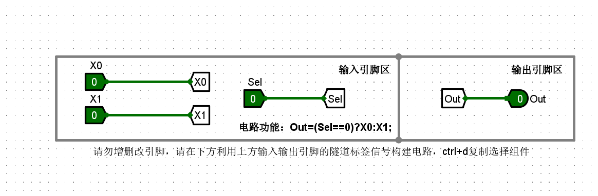
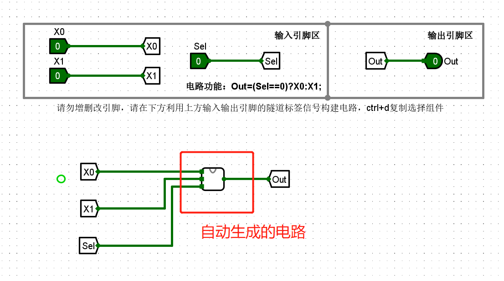
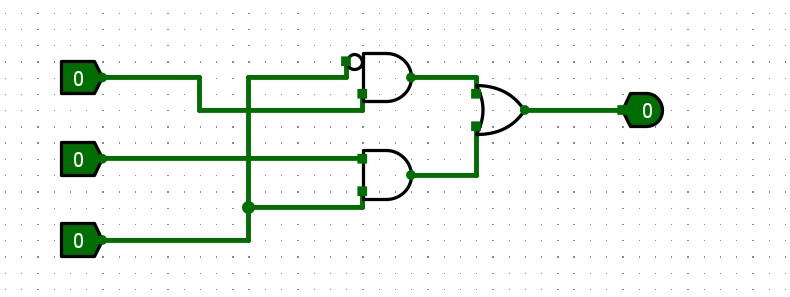
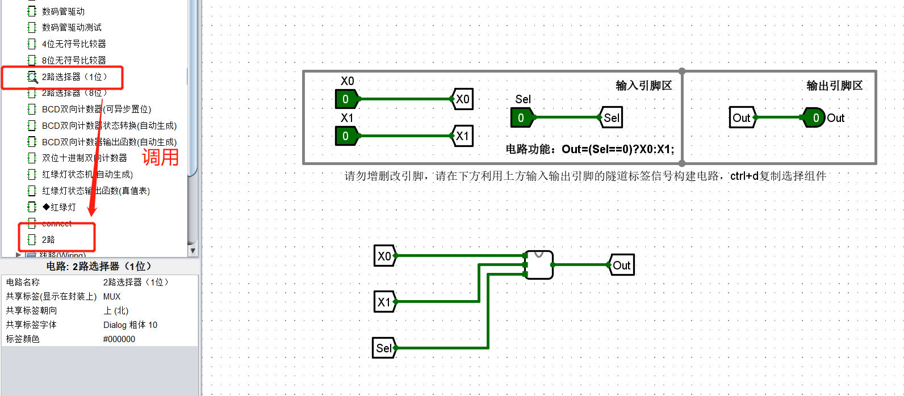

# logisim入门实验问题汇总-week1

## 课堂实验

### 问题1：线是蓝的或者红的。怎么点小手的调试按钮都没有反应？

解决方法：
- 检查电路有没有连错，有没有线连在一起了？
- 重启logisim软件

### 问题2：在本地测试没问题，提交到头歌平台都是xxx？

原因：有的电路为了评测方便，固定好了引脚。比如下面这样：
    

如果用自动电路生成，就会覆盖掉设置好的引脚，导致在头歌平台评测失败。

解决：

可以新建空白电路用自动生成电路的功能生成，然后在主电路连起来。

自动生成的电路
<figure markdown="span">
    
  <figcaption>自动生成电路结果</figcaption>
</figure>
<figure markdown="span">
    
  <figcaption>调用自动生成的电路</figcaption>
</figure>