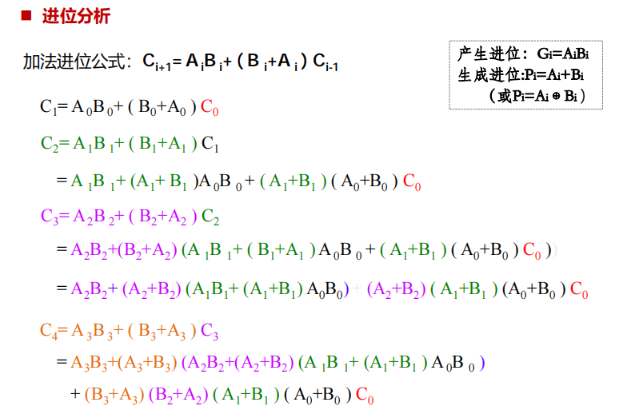
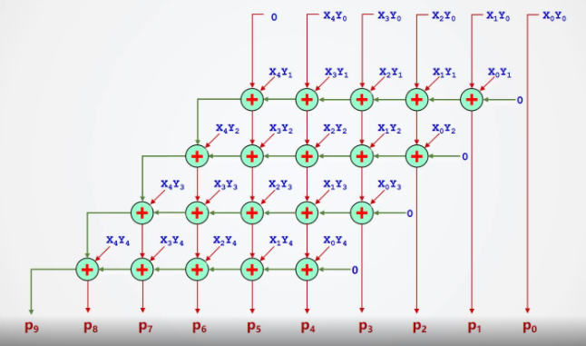
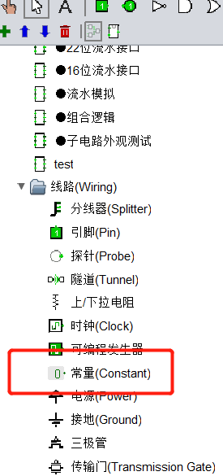
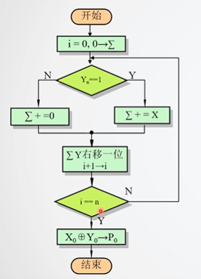
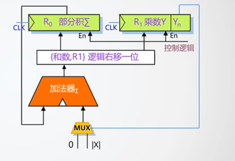

# 运算器设计实验

本周实验是运算器设计（HUST）：[https://www.educoder.net/shixuns/f8tlev94/challenges](https://www.educoder.net/shixuns/f8tlev94/challenges "https://www.educoder.net/shixuns/f8tlev94/challenges")

以下实验不能增删改引脚，也不需要使用自动生成电路的功能。

头歌平台实验讲解内容简介：如果看了实验文字介绍感觉有点懵，可以看下视频介绍。

- 第 1 关：总体实验框架。（如果对第 1 关的实验手足无措，可以看下第 2 关的实验讲解）
- 第 2-5 关：1-5 关的实验讲解。（2-5 关的实验讲解都是一样的，挑一个看就行）
- 第 6 关：阵列乘法器性能分析、6-8 关实验介绍。
- 第 7-8 关：实验讲解和第 6 关的第二个一样。
- 第 9 关：原码一位乘法器实验介绍
- 第 10 关：补码一位乘法器实验介绍
- 第 11 关：MIPS 运算器设计实验介绍

### 8 位可控加减法电路设计

回想一下之前做过的一个实验：神奇的异或门。

### CLA182 四位先行进位电路设计

尽量使用多输入的与门。减少延迟。

提示：

### 4 位快速加法器设计

有的线需要穿过模块下方。注意不要连在一起短路。

**需要注意的是不同教材上传递函数 P 略有差异，部分教材传递函数 P 是逻辑或关系，本实验采用的是异或逻辑。**

### 16 位快速加法器设计

考察如何用 4 个快速加法器和一个先行进位电路构成 16 位快速加法器。

### 32 位快速加法器设计

可能方案

（1）2 个 16 位加法器直接串联，C16 信号采用下层的进位输出；

（2）2 个 16 位加法器直接串联，C16 进位输入采用上层的进位输出；

（3）在 16 位快速加法器的基础上再增加一级组间先行进位电路，类似 64 位快速加法器的方法；

### 5 位无符号阵列乘法器设计

不要用输入引脚来代替下图中的 0。因为会引入多余的封装引脚。

用线路库中的“常量”实现 0。

### 乘法流水线设计

- 可能需要用到库自带的位扩展器、加法器、移位器。
- 位扩展器能做什么？例如 8 位扩展器能将 1 扩展为 0000 0001
- 位扩展器位于线路库中。
  - 注意位扩展器的 **属性** ：扩展方式

完成流水线实验后，可以单步调试（Ctrl+I）看看流水线是怎么运行的。

### 原码一位乘法器设计

重点掌握 **寄存器** 和 **多路选择器** 的使用。

流程：

示意电路图：

### MIPS 运算器设计

- 可能需要用到位扩展器。
- 可以用库自带的乘法器，除法器。
- 主要还是考虑 **溢出** 的情况。
