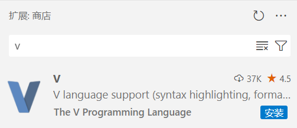

# Verilog 入门实验

实验环境搭建参考 [在 Windows 系统中使用 iverilog + GTKWave](../verilog/verilog-windows.md) 和 [iverilog + GTKWave 环境安装及使用（Ubuntu 虚拟机）](../verilog/iverilog-gtkwave-environment-installation-usage.md)

### 问题 1：条件运算符

题目 [条件运算符](https://oj.verilog.fun:23536/oj/problem/49) 使用时序逻辑实现的时候，判题可能会出现错误。这是由于判题的采样周期问题。

### 问题 2： 编写仿真文件、生成时钟信号

题目 [编写仿真文件](https://oj.verilog.fun:23536/oj/problem/48) 和题目 [生成时钟信号](https://oj.verilog.fun:23536/oj/problem/47)，**不应该** 在代码中包含``timescale 1ns/1ps`

### 问题 3：VS Code 的 Verilog 插件

请 **不要** 安装 V 语言插件，它会关联 `.v` 文件，影响 Verilog 插件运行。

