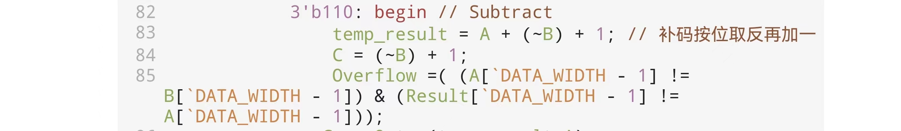
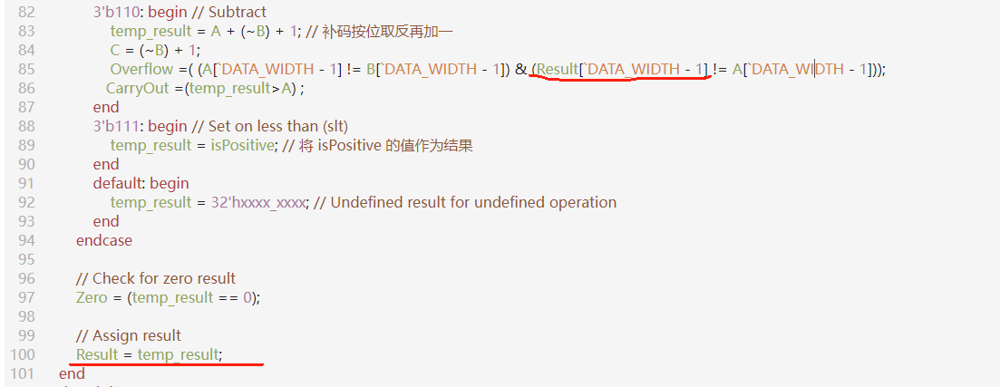

# 基本功能部件设计

### 问题 1： 语法错误：`syntax error in continuous assignment`

这个语法错误可能会出现很多种情况，下面列举上课时同学们遇到的几种情况：

#### 情况 1

下面的代码中，出现了 `1'b2` 的值，会导致该语法错误：

```verilog
wire a;
assign a = 1'b2';
```

`b` 后面只能跟 `0` 和 `1`，如果要表示十六进制，可以用类似 `16'hffff` 的方式来表达。

#### 情况 2

`iverilog` 的语法解析较为简单，可能无法通过报错信息完全定位错误。这种的情况也仍然会报该语法错误：

```verilog
wire a;
wire b;
wire c;
assign a = b and c;
```

Verilog 语法中没有使用 `and` 作为逻辑与操作符，取而代之的是 `&&`。

!!! tip "哪些编程语言使用 `and` 作为逻辑与"
    常见编程语言中 Python、Ruby 和 Lua 使用 `and`，我们可能常用 Python 进行编程，因此在 Verilog 实验中容易混淆。


#### 情况 3

缺少括号或者多了括号。

```verilog
wire a;
wire b;
assign a = ((b);
```

### 问题 2：`syntax error I give up.`

例如：
```verilog
wire a；
assign a = （a + 1）；
```
一旦使用全角字符（中文的括号或者中文的分号），例如“；”与“`;`”，“（”与“`(`”，`iverilog` 会给出出错行号，仔细排错即可。

!!! warning "注意"
    一些严重语法错误 `iverilog` 会立刻停止，隐藏了它之后的语法错误。例如 `wire a；` 此行报错，而 `assign a = （a + 1）；` 都还没解析到就 `I give up` 了。我们需要将错误行号修改正确之后再编译。


### 问题 3：评测结果和手算结果不同？

对于该样例：

`ERROR: A = 00000002, B = ffffffff, ALUop = 6, Result = 00000003, Overflow = 1, OverflowReference = 0.`

`A` 的最高位和 `B` 的不等，前一项为 `1`；结果的最高位和 `A` 的最高位相等，后一项为 `0`，两项与一下还是 `0`，就是没有溢出。但是跑出来还是溢出？



**解决方法：**

由于是 `Overflow` 是减法操作出错，所以我们重点关注 `Overflow` 变量。我们可以看到 `Overflow ` 的结果由两个值相与得到，最后评测结果为 `1`。说明这两个值都为 `1`，前者为 `1` 和手工计算结果相同，没有问题，说明问题出在后者。

仔细检测后者的代码，会发现 `Result` 在 `always@( *)` 中的最后才赋值为 `temp_result`，但是在 `case` 前却被使用了，那么这个时候的 `Result` 的值是上个阶段的值，因此导致了错误。



PS：如果去看波形，会发现在这个时刻，`Result` 的值和 `temp_result` 的值是一样的。这是因为波形图最后给的是 `always@( *)` 执行完的 `Result` 的值。

!!! note "建议"

    要表示 32 位的 `1`，除了以下这种方法

    ```c
    assign Bb = ~B + 32'b0000_0000_0000_0000_0000_0000_0000_0001;
    ```

    还有个简洁的方法是

    ```c
    assign Bb = ~B + 32'b1;
    ```
