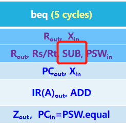
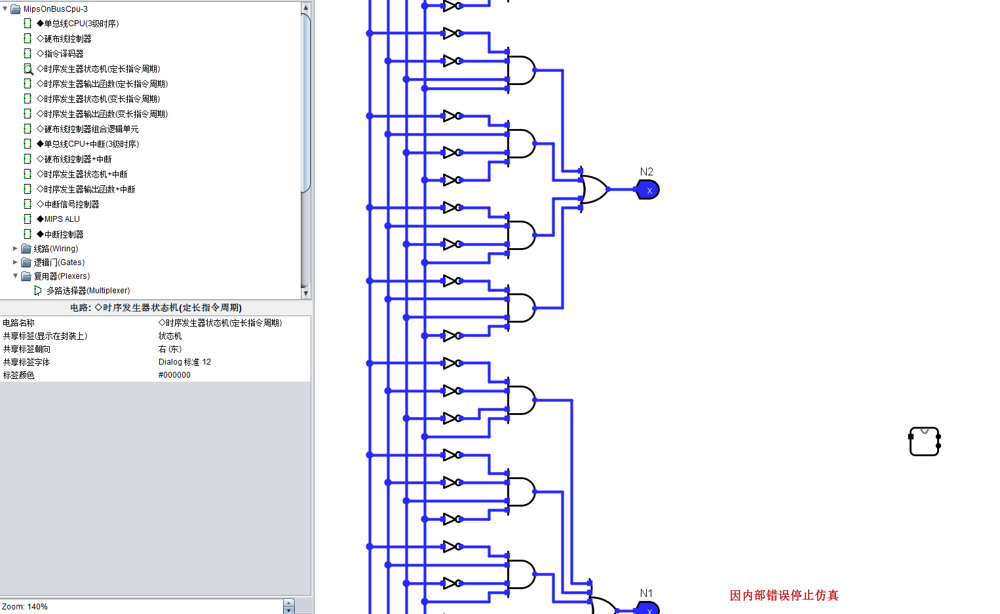
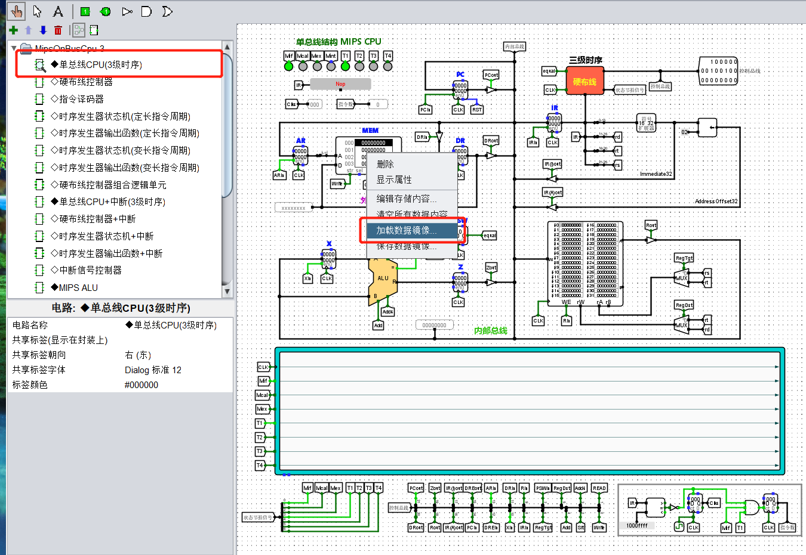
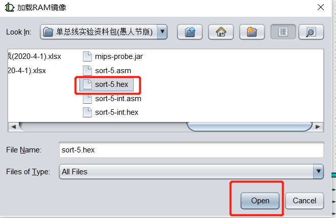
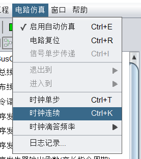
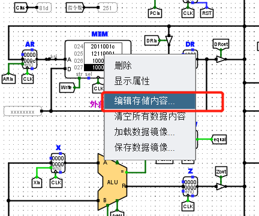
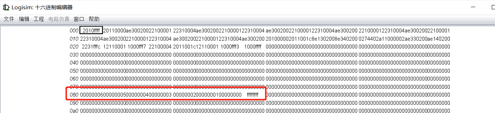
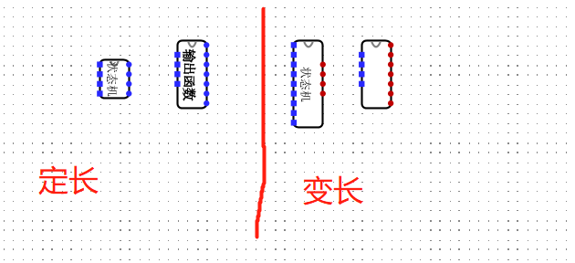
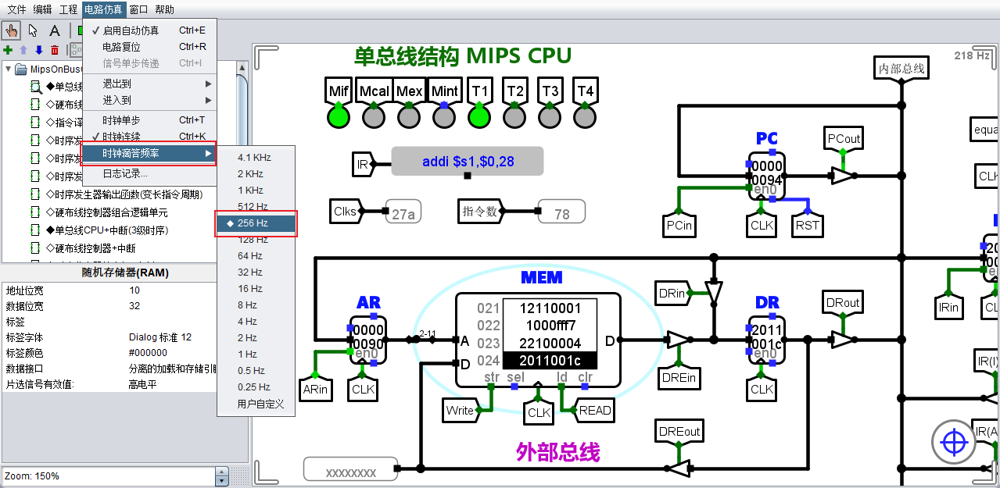
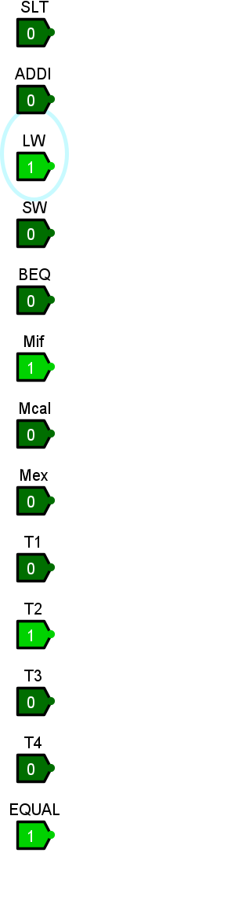

# 单总线 CPU 设计


### 问题 1： BEQ 指令 SUB 信号问题

Excel 中没有 `beq` 指令需要的 `sub` 信号，

{: style="height:150px"}

### 问题 2： `PSW.equal` 信号表示什么？

`PSW` 是状态标志寄存器，也就是存放 ALU 的一些标志位，比如进位标志。这里的 `PSW.equal` 指的是 `equal` 标志位。

在 Excel 里的位置是输入信号列表里的 `equal`。


### 问题 3：Logisim 无法删除元件/ 无法关闭

当我们在子电路中不小心拖拽了一个使用了这个子电路的电路，此时，无法删除这个元件，Logisim 判断所删除的元件被子电路使用，发生了循环嵌套，可能导致 Logisim 无法关闭，并且在电路仿真的时候会出现“因内部错误停止仿真”的提示。

例如在本次实验中，如果我们在“◇时序发生器输出函数(定长指令周期)”电路图中，不小心拖入了“◆单总线 CPU+中断(3 级时序)”，有概率出现上述情况。




为了解决这个问题，我们需要手动编辑崩溃的 `.circ` 文件，记住拖入错误的电路名称（例如◇时序发生器输出函数(定长指令周期)）和元件名（◆单总线 CPU+中断(3 级时序)）称，使用任务管理器 **强制结束** 卡死的 Logisim 进程，接着使用记事本或者 VS Code 打开 `.circ` 文件。

!!! note "circ 文件"
    `.circ` 本质是 `XML` 格式（可扩展标记语言，Extensible Markup Language）

搜索电路名称，例如 `<circuit name="◇时序发生器输出函数(定长指令周期)">`，找到形如：

```xml
...
  <circuit name="◇时序发生器输出函数(定长指令周期)">
    <a name="circuit" val="◇时序发生器输出函数(定长指令周期)"/>
    <a name="clabel" val="输出函数"/>
    <a name="clabelup" val="east"/>
    <a name="clabelfont" val="Dialog bold 14"/>
    <a name="clabelcolor" val="#000000"/>
    <wire from="(80,790)" to="(140,790)"/>
...
```
此时，点击文本，使光标停留在附近，开始搜索元件名称例如 `◆单总线CPU+中断(3级时序)`，找到

```xml
...
    </comp>
    <comp loc="(1360,1400)" name="◆单总线CPU+中断(3级时序)">
      <a name="facing" val="east"/>
      <a name="label" val=""/>
      <a name="labelloc" val="north"/>
      <a name="labelfont" val="Dialog plain 12"/>
      <a name="labelcolor" val="#000000"/>
    </comp>
    <comp lib="0" loc="(470,2830)" name="Pin">
...
```
删除属于此元件的 **整个 `xml` 标签**，从 `<comp ...` 到 `</comp>`，保存，并重新打开，若还出现“因内部错误停止仿真”的提示。则尝试电路复位并重新开启仿真。


### 问题 4：如何加载数据镜像？

在单总线 CPU（3 级时序），右键点击加载数据镜像。



选择 `sort.hex`，然后 Open。

{: style="height:250px"}

接着在电路仿真菜单栏下，点击时钟连续。

{: style="height:150px"}

等待运行完毕，即 `MEM` 的指令不在变化。然后查看 `MEM` 中的内容，看是否排序成功。



然后就可以看到排序后的结果。



### 问题 5：注意变长指令的状态机和输出函数封装

连变长指令的硬布线控制器注意要将 **状态机** 和 **输出函数** 换成变长指令的。因为头歌测试变长的电路图和定长的电路图是在一块。

{: style="height:250px"}


### 问题 6：时钟滴答

在一些需要等待时钟到达特定周期的实验中，我们可以通过设置时钟滴答频率来加速仿真。





### 问题 7：如何调试硬布线控制器组合逻辑单元（第四关）

!!! tip "头歌平台 提示"
    如果最后输出的控制信号与标准答案不一致，可以将对应的 `OCinput` 值加载在控制器上，检查控制总线与标准值的差异，重新填表生成相应控制信号。

这里需要注意，头歌平台给出的 `OCinput` 是十六进制，例如不一致的 OCinput 为 `0489`，转为二进制 `0 0100 1000 1001`，一共 13 位，与控制器电路输入对应：

{: style="height:550px"}


