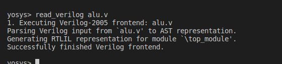
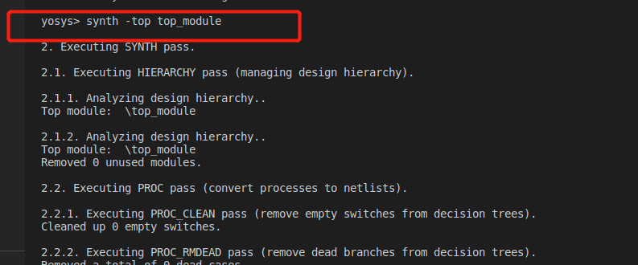
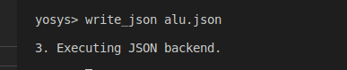
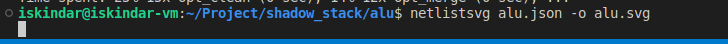

# 如何生成原理图

## 安装依赖

```bash
sudo apt-get install yosys

# 如果无法运行，可能需要安装的依赖如下
sudo apt-get install build-essential clang bison flex \
  libreadline-dev gawk tcl-dev libffi-dev git \
  graphviz xdot pkg-config python3 libboost-system-dev \
  libboost-python-dev libboost-filesystem-dev zlib1g-dev

# 需要先安装npm
sudo apt-get install npm

# 安装netlistsvg
npm install -g netlistsvg

```

## 综合

使用yosys对Verilog代码文件进行综合。命令行输入yosys，会生成yosys的shell，然后依次输入read\_verilog，synth，write\_json命令

```bash
yosys> read_verilog YOUR_MODULE.v
yosys> synth -top YOUR_TOP_MODULE
# 在使用yosys仿真之后，需要先生成json文件
yosys> write_json YOUR_JSON.json

```

## 生成原理图

使用netlistsvg生成原理图

```bash
# 随后使用该工具生成原理图
netlistsvg YOUR_JSON.json -o YOUR_PICTURE
```

最后生成的图片是SVG格式，可以用火狐浏览器打开。但是太大的图片，需要别的SVG图片浏览工具来看。

## 示例

在alu.v所在文件的目录输入yosys，如图所示。


在yosys的shell中输入`read_verilog alu.v`读取alu.v文件



输入synth开始综合



导出综合后的文件为json文件



按ctrl+d退出yosys终端，输入命令 `netlistsvg alu.json -o alu.svg`可以看到生成了alu的原理图



然后可以使用浏览器或者别的工具打开SVG图片。

我测试了下同学使用always@( \*)构造的ALU，实际原理图大小有1.4MB，使用assign实现的ALU，原理图大小是686.2KB。

参考资料：

- [https://github.com/YAVGroup/Verilog-OJ/blob/master/doc/research/Verilog仿真和综合工具.md](https://github.com/YAVGroup/Verilog-OJ/blob/master/doc/research/Verilog仿真和综合工具.md "https://github.com/YAVGroup/Verilog-OJ/blob/master/doc/research/Verilog仿真和综合工具.md")
