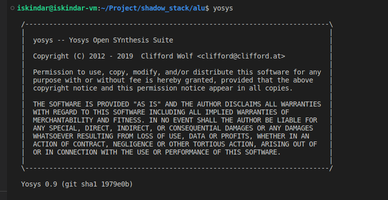

# 如何生成原理图

## 在线预览原理图

可以在 [https://digitaljs.tilk.eu/](https://digitaljs.tilk.eu/) 网站上填入 `.v` 代码，直接生成原理图。


如果你希望在本地生成原理图，可以继续往下看：

## 使用 `yosys` 工具生成原理图

### 安装依赖


在 Ubuntu 20.04 上测试：

```bash
安装 yosys
sudo apt-get install yosys

# 需要先安装 npm
sudo apt-get install npm

# 安装 netlistsvg
npm install -g netlistsvg
```


### 综合

使用 `yosys` 对 Verilog 代码文件进行综合。命令行输入 `yosys`，进入 `yosys` 交互式命令行，然后依次输入 `read_verilog` 读取 `.v`、`synth` 综合和 `write_json` 输出 `.json` 的命令

```bash
yosys> read_verilog YOUR_MODULE.v
yosys> synth -top YOUR_TOP_MODULE
# 在使用 yosys 仿真之后，需要先生成 json 文件
yosys> write_json YOUR_JSON.json

```

### 生成原理图

使用 `netlistsvg` 生成原理图

```bash
随后使用该工具生成原理图
netlistsvg YOUR_JSON.json -o YOUR_PICTURE
```

最后生成的图片是 SVG 格式，可以用火狐浏览器、Edge 浏览器打开。注意 SVG 文件可能很大，会造成浏览器卡顿。

### 示例

在 `alu.v` 所在文件的目录输入 `yosys`，如图所示。



在 yosys 的 shell 中输入 `read_verilog alu.v` 读取 alu.v 文件


输入 `synth` 开始综合


导出综合后的文件为 `.json` 文件


按 Ctrl + D 退出 `yosys` 终端，输入命令 `netlistsvg alu.json -o alu.svg` 可以看到生成了 ALU 的原理图


然后可以使用浏览器或者别的工具打开 SVG 图片。
