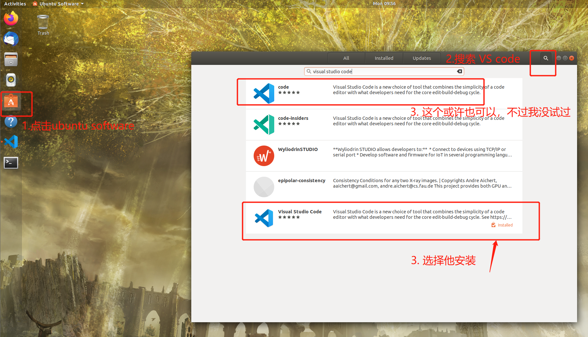
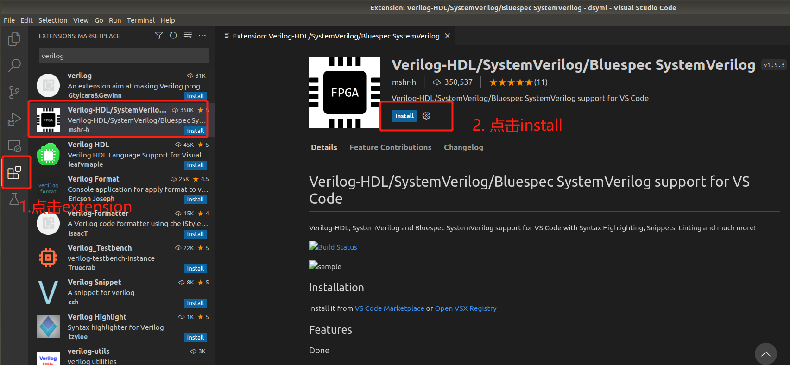
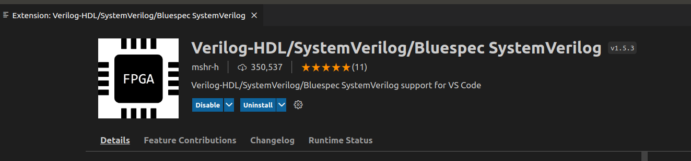
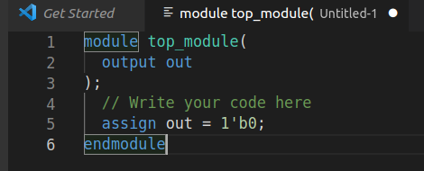
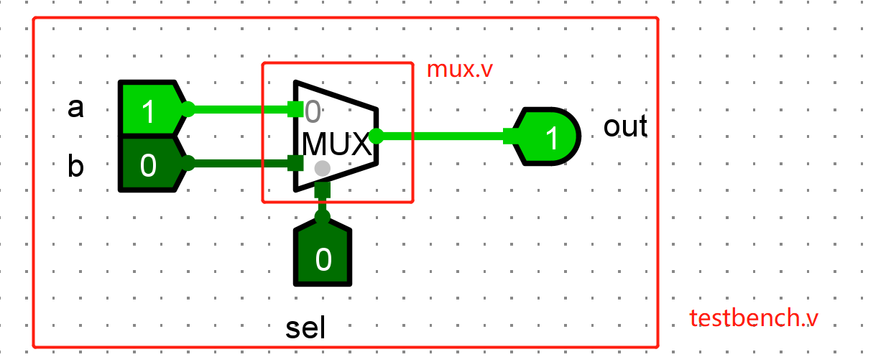
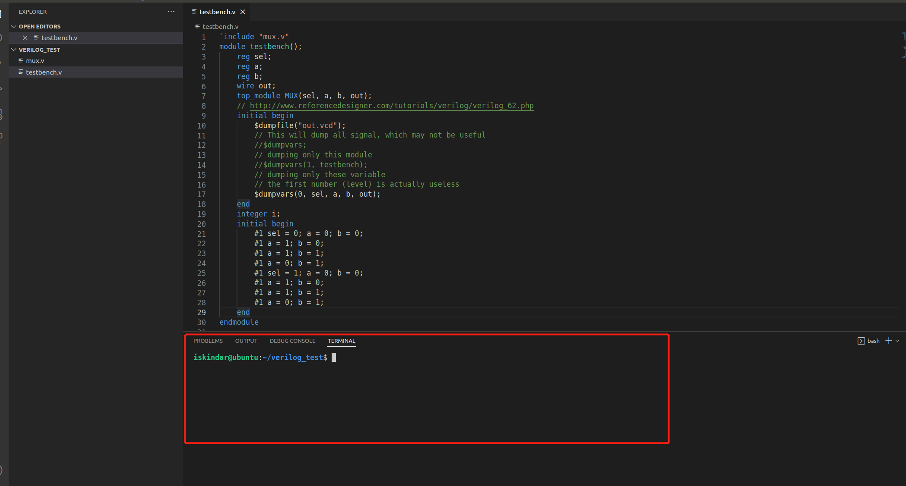
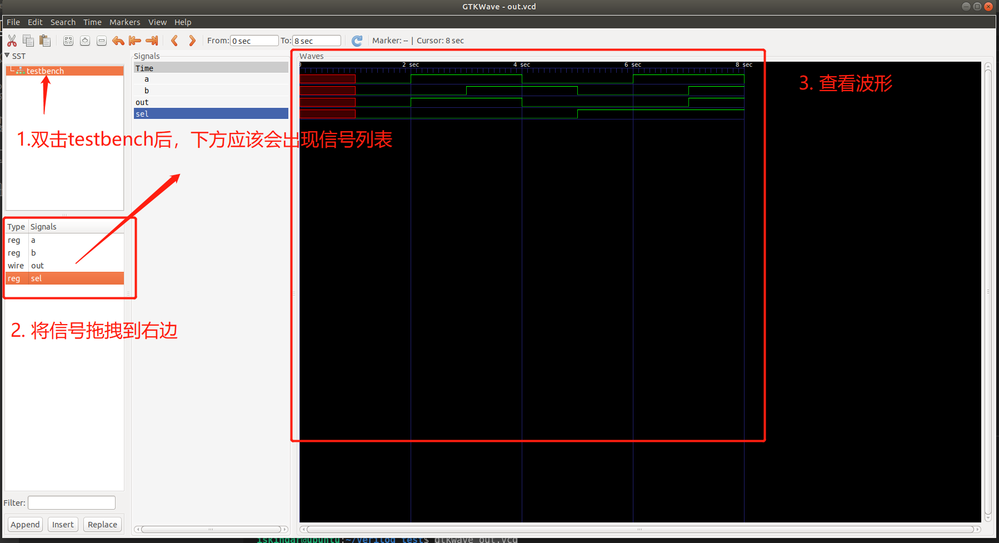

# iverilog + GTKWave 环境安装及使用

> 如果是 Windows 系统，那么我们推荐 [在 Windows 系统中使用 iverilog + GTKWave](verilog-windows.md)

## 安装

主要分为三个步骤，安装虚拟机管理软件、Linux 操作系统和电路仿真所需要的一些软件。

### 安装虚拟机软件

如果已经安装了 VirtualBox 或者 VMware 的软件，可以跳过该步骤。这两类软件都是虚拟机管理的软件。其中 VMware Workstation Pro 是商业软件。

VMware Workstation Pro 的安装可以参考下面链接：

[VMware 虚拟机下载与安装教程（详细步骤-图文结合）](https://zhuanlan.zhihu.com/p/569267450)

VirtualBox 的安装可以参照下面链接：

[win10 虚拟机 Oracle VM VirtualBox 安装和使用教程](https://zhuanlan.zhihu.com/p/111567471)

### 安装 Ubuntu

Ubuntu 16.04、Ubuntu 18.04 和 Ubuntu 20.04 在本次研讨课实验中都能使用，如果已经安装了其中的一个版本，就可以跳过这个步骤。如果没安装的话，建议安装 Ubuntu 20.04。

VirtualBox 安装 Ubuntu 20.04 可以参照：[win10 虚拟机 Oracle VM VirtualBox 安装和使用教程](https://zhuanlan.zhihu.com/p/111567471)

VMware Workstation Pro 安装 Ubuntu 20.04 可以参照：[https://zhuanlan.zhihu.com/p/141033713](https://zhuanlan.zhihu.com/p/141033713)

其实二者都是大同小异。课程所用的软件不是很大，分配空间 20GB 应该就足以用了。考虑到同学们后续课程的实验可能也会用到 Ubuntu 系统，可以稍微分配多点空间。当然，后续也可以再调整分配空间。

### 安装 iverilog + GTKWave

这部分需要安装两个软件：

- iverilog：用于编译 Verilog 文件；
- GTKWave：仿真波形。

选择这两个软件的原因是：

- 不需要太大的存储空间（早期实验环境使用 Vivado，需要 80G 的存储。许多同学卸载了很多软件才装上）；
- 简单易用，不需要等待很长时间就能看见结果；
- 足以支持本次实验。

缺陷：

- 无法检测组合逻辑环；
- 只是仿真，所写的代码不一定能够实际运行在板子上。

在 Ubuntu 的命令行中输入以下两个命令：

```bash
sudo apt-get update
sudo apt-get install iverilog gtkwave

```

以上就安装好了本次实验的必备软件。下面介绍 Ubuntu 中安装 vscode，以及 verilog 高亮插件。

在 Ubuntu 的应用商店，找到 VS Code 安装。（有同学觉得 Ubuntu 应用商店下的 VS Code 不好用，原因可能是低版本的 Ubuntu（比如 16.04）的应用商店的 VS Code 是老版本，也可以去官网下载最新版本的 VS Code，具体教程可参考：[https://zhuanlan.zhihu.com/p/44249511](https://zhuanlan.zhihu.com/p/44249511)）



进入 VS Code，点击侧边栏的 extension，然后点击 `Install` 安装该插件。



安装完毕后插件后，应该会显示卸载 `Uninstall` 按钮。



试着新建个文件写 Verilog 代码，就会发现，已经出现代码高亮了。



至此，前期环境工作基本完成了。

## 使用

下面来实际演示如何使用 iverilog 和 GTKWave。

下面的代码是个二选一的 1 位选择器。但其只是一个电路模块，我们还需要喂给其输入，他才会有输出，也就才会有波形。

```verilog
module top_module(
      input sel,
      input a,
      input b,
      output out
  );
  // Write your code here
    assign out = (sel)?b:a;
endmodule
```

所以，我们还需要写 testbench，来生成输入，喂给该模块。

```verilog
`include "mux.v" 
module testbench();
    // 一般输入用 reg，输出用 wire
    reg sel;
    reg a;
    reg b;
    wire out;
    top_module MUX(sel, a, b, out); // 实例化二选一选择器模块
    
    initial begin
        $dumpfile("out.vcd");// 导出波形文件
        $dumpvars(0, sel, a, b, out);// 导出这四个信号的值，这样波形会有这些信号
    end
    // 每隔1个时间单位，变化输入 a，b，sel 的值
    initial begin
        #1 sel = 0; a = 0; b = 0;
        #1 a = 1; b = 0;
        #1 a = 1; b = 1;
        #1 a = 0; b = 1;
        #1 sel = 1; a = 0; b = 0;
        #1 a = 1; b = 0;
        #1 a = 1; b = 1;
        #1 a = 0; b = 1;
    end
endmodule

```

用 Logisim 表示上面两个 Verilog 电路的逻辑就是：mux.v 实现了一个器件，testbench.v 把他包起来了。



在 vscode 界面下，输入快捷键 ctrl+\~（esc 下面那个键），应该会看到下方出现了一个命令行。



输入下面命令，-o 选项类似 gcc 的-o，就是将生成的可执行文件命名为 test

```bash
iverilog testbench.v -o test
```

然后可以看到目录下多了个 test 文件，继续输入命令，执行该文件：

```bash
vvp test
```

然后应该会看到提示，并且生成 out.vcd 的文件。

> VCD info: dumpfile out.vcd opened for output.

现在输入 `gtkwave` 命令查看仿真波形

```bash
gtkwave out.vcd

```

即可出现如下界面，并按下图所示操作，即可查看波形



由于 testbench 不是本次实验的重点，实验过程中只需要大家实现模块即可，模块对应的 testbench 会提供给大家。

如果想知道更多的 GTKWave 的资料，可以去看官网文档：[GTKWave 3.3 Wave Analyzer User's Guide](http://gtkwave.sourceforge.net/gtkwave.pdf)
