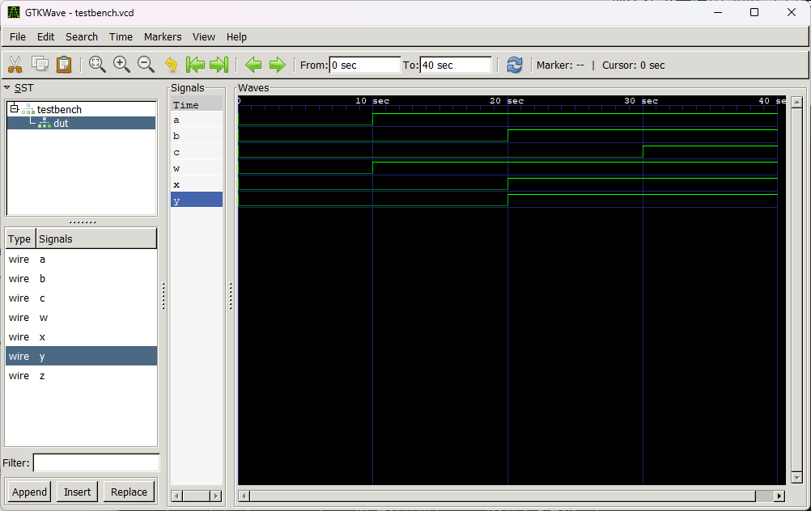

# 在 Windows 系统中使用 iverilog + GTKWave

网友 [Pablo Bleyer Kocik](https://bleyer.org/) 使用 MinGW 构建了 Icarus Verilog for Windows，因此我们可以不需要 Linux 环境就能运行 iverilog。于此同时，在安装包中附带了 GTKWave，这样我们能一次性将 Verilog 所需的实验环境搭建完成。


## 下载 Icarus Verilog for Windows

我们可以在 [https://bleyer.org/icarus/](https://bleyer.org/icarus/) 下载 Icarus Verilog for Windows，我们选择最新的发行版本，例如 `iverilog-v12-20220611-x64_setup [18.2MB]`。


## 安装 Icarus Verilog for Windows

打开安装包，按默认配置安装，


默认全量安装，自动勾选 MinGW 相关依赖和 GTKWave。


在这个页面中，我们 **勾选** `Add executable folder(s) to the user PATH`，这样安装程序就会在环境变量中加上 `iverilog` 的 `bin` 目录。


接下来一路“下一步”，直到安装完成。


## 测试 Verilog 编程环境

!!! warning "注意"

    环境变量修改之后，一般情况下，你需要重启程序，才能生效。例如，你安装 Icarus Verilog for Windows 之前打开 VS Code 的终端栏，在你安装之后，键入 `iverilog` 依然会提示没有该程序，你需要 **关闭所有的 VS Code 窗口**，然后再次打开。


我们编写一个简单的测试 `demo`，以多个端口的模块为例子：

```verilog

module top_module( 
    input a,b,c,
    output w,x,y,z );
    
    assign w = a;
    assign x = b;
    assign y = b;
    assign z = c;
    
endmodule

```

保存为 `top.v`

接下来，编写一个简单的 `testbench.v`：

```verilog
module testbench;
    
    // Inputs
    reg a, b, c;
    
    // Outputs
    wire w, x, y, z;
    
    // Instantiate the module under test
    top_module dut (
        .a(a),
        .b(b),
        .c(c),
        .w(w),
        .x(x),
        .y(y),
        .z(z)
    );
    
    // Clock generation
    reg clk;
    always #5 clk = ~clk;
    
    // Initialize signals
    initial begin
        a = 0;
        b = 0;
        c = 0;
        clk = 0;
        
        // Open VCD file for dumping
        $dumpfile("testbench.vcd");
        $dumpvars;
        
        // Change inputs
        #10 a = 1;
        #10 b = 1;
        #10 c = 1;
        
        // Stop simulation
        #10 $finish;
    end
    
    // Toggle clock
    always #5 clk = ~clk;
    
endmodule

```

此时，目录下有 `top.v` 和 `testbench.v`，我们打开终端，键入：


```bash
iverilog -o demo.vvp testbench.v top.v
```
!!! tip "小技巧"

    Windows 终端也可以按下 `Tab` 键补齐，只不过它可能纠正你的路径为 `.\testbench.v` 这样的带有反斜杠的形式。

!!! bug "Bug"

    该版本的 `iverilog` 需要将 `-o` 参数写在输入的 `.v` 文件之前。以下的写法会报错 `-o: No such file or directory`

    ```verilog
    iverilog testbench.v top.v -o demo.vvp
    ```

此时，目录下产生 `demo.vvp`，`.vvp` 文件是由 iverilog 编译器生成的，它包含了仿真可执行文件的二进制数据。`.vvp` 文件可以被 `vvp` 工具加载和运行，以执行 Verilog 或 VHDL 代码的功能仿真。

那么接下来使用 `vvp` 工具进行模拟仿真：

```bash
vvp demo.vvp
```

如果一切正常，那么我们会得到以下的输出：


```
VCD info: dumpfile testbench.vcd opened for output.
testbench.v:41: $finish called at 40 (1s)
```

我们将在目录下看到 `testbench.vcd` 文件，此时需要用 GTKWave，键入：

```bash
gtkwave.exe testbench.vcd
```

这将会打开 GTKWave 的界面，在左侧栏中的 SST 展开选择 `dut`，然后拖入一些我们关心的信号到波形图中，就可以看波形图了。

